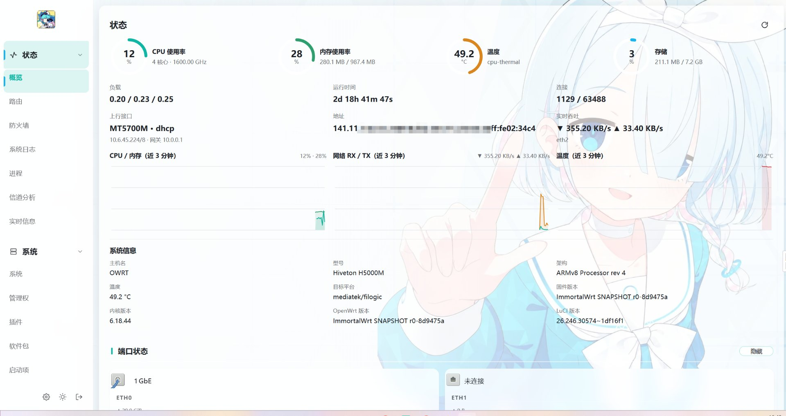
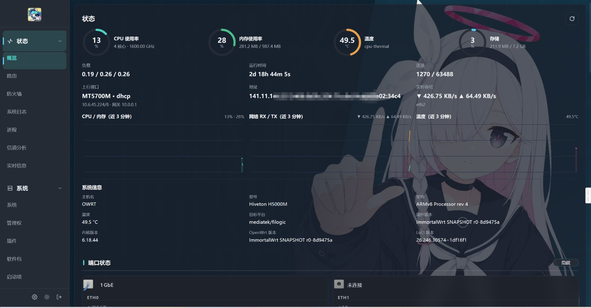
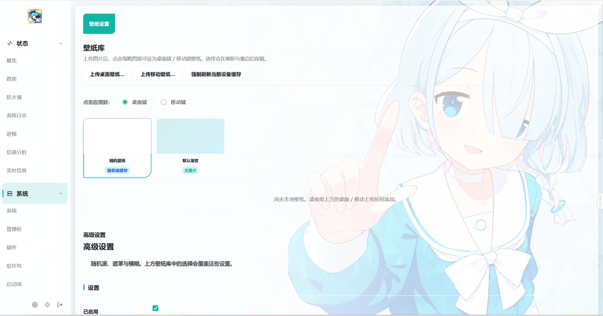
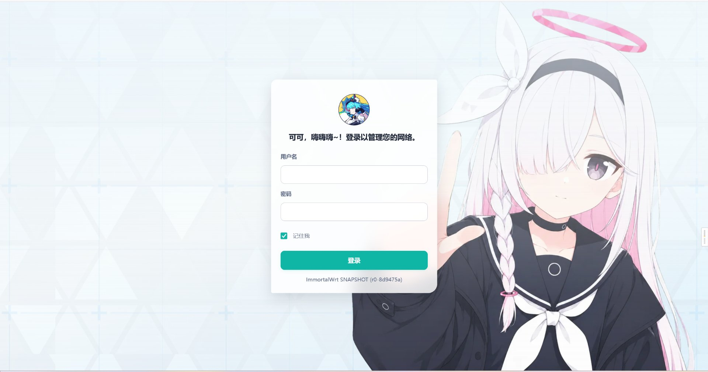
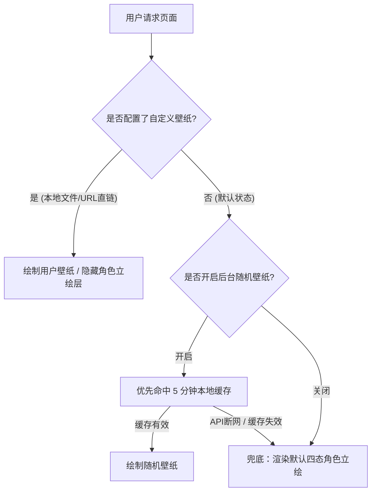

<div align="center">


# Mint (luci-theme-mint)

**面向 OpenWrt main / LuCI master 的下一代现代化原生主题**

基于纯净 ucode 模板引擎构建 • 融合 Apple / Linear 级极简与克制美学  
单层视效容器 • 四态独立角色立绘 • 现代设计令牌 (Tokens) 系统 • 独立壁纸扩展包

<p align="center">
  
  
  
  
  
</p>

[✨ 功能特性](#-功能特性) • [🖼️ 界面预览](#-界面预览) • [📁 目录结构](#-目录结构) • [🚀 快速启用](#-主题启用) • [📦 编译指南](#-编译指南) • [🎨 背景机制](#-背景与壁纸机制) • [⚙️ 壁纸配置](#️-壁纸设置) • [🌐 兼容性](#-兼容性) • [🛠️ 排错与授权](#️-故障排查)

---

</div>

> **Notice**: 本主题包名与路径已随 2026-09-07 更名统一为 `mint`。原生基于 LuCI master 的 ucode 模板与客户端渲染接口重构，并非传统针对旧主题的单纯 CSS 换肤。

---

## 📖 目录

- [✨ 功能特性](#-功能特性)
- [🖼️ 界面预览](#-界面预览)
- [📁 目录结构](#-目录结构)
- [📦 编译指南](#-编译指南)
  - [云编译（GitHub Actions）](#云编译github-actions)
  - [本地编译（方式一：预编译 SDK 推荐）](#方式一官方预编译-sdk推荐)
  - [本地编译（方式二：完整 Buildroot）](#方式二完整-buildroot)
- [🚀 主题启用](#-主题启用)
- [🎨 背景与壁纸机制](#-背景与壁纸机制)
  - [四态独立角色层](#1-默认背景四态角色层无需任何配置)
  - [用户自定义壁纸](#2-用户壁纸可选覆盖角色层)
  - [离线行为与判定时序](#3-离线弹性兜底与执行流程)
  - [静态版本缓存戳](#4-缓存戳机制)
- [⚙️ 壁纸设置 (UCI 参数)](#️-壁纸设置)
- [🌐 兼容性与运行规范](#-兼容性)
  - [支持固件与包格式](#兼容的-openwrt--immortalwrt-版本)
  - [运行时依赖清单](#运行时依赖)
  - [浏览器与已知限制](#浏览器)
- [🛠️ 故障排查](#️-故障排查)
- [📄 开源许可证](#-许可证)

---

## ✨ 功能特性

### 🏛️ 结构工程与视觉规范
- **单层视觉容器架构**：全站仅保留一个视觉容器 `.mz-view`，统一绘制背景、边框、圆角与阴影；内部 Section / CBI / 表格 / 卡片全部透明扁平化，禁止嵌套卡片（Card 套 Card）。
- **单次模糊设计**：壁纸置于最底层，每页仅触发一次模糊计算，杜绝创建杂乱的层叠上下文（Stacking Context），彻底消除下拉菜单被截断的弊端。
- **独立底栏**：Action Bar（操作栏）为独立功能层，底部全出血粘性吸附（Sticky），体验沉浸。
- **分层 CSS 编排**：`cascade.css` 严格作为入口仅执行 `@import`，将规则按职责解耦为 `compat / tokens / base / layout / navigation / container / components / wallpaper / background / dark / animations / responsive / login` 共十三层。全站静态资源带 `?v=<MINT_ASSET_REV>` 统一版本戳。
- **容器几何单一所有者**：`.mz-view` 的尺寸与留白严格由 `layout.css` 与 `container.css` 配合 Tokens 控制，大屏居中对称，最大宽度约束为 `--mz-content-max: 1920px`。
- **Glass & Layered 视觉系统**：不对称微妙圆角、品牌色偏移阴影、节标题强调色条、侧栏半透毛玻璃、菜单线性 SVG 图标与平滑折叠箭头。

### 🎭 角色背景与色彩模式
- **纯 CSS 四态角色背景**：默认预置四套独立立绘层（PC 亮色 Arona / PC 暗色 Plana / 移动端亮暗两套独立 3:4 竖版构图）。媒体查询判别设备，`<html data-theme>` 控制色彩，**首帧即达，无需 JS 介入，切换平滑交叉淡入**。
- **专属登录页角色（Plana）**：采用 `.mz-login-char` 单立绘节点，PC 端右侧锚定、移动端底部全幅展示，仅区分角色背景与自定义壁纸两态。
- **三态色彩体系**：支持「浅色（白透毛玻璃）」、「深色（深灰磨砂，告别纯色死黑）」与「跟随系统」无缝切换。

### ⚡ 性能与交互打磨
- **零外部资源依赖**：无 CDN、无外部 Web 字体、无体积沉重的图标字体、无重量级前端框架、无 jQuery。
- **现代化响应式断点**：480px 至 1280px+ 全段平滑适配；移动端自动收纳为抽屉式遮罩导航，复杂数据表格自动重排为可读性更高的卡片流。
- **真实总览增强仪表盘**：重构 Overview 总览页（仅在对应路由按需加载），实时卡片化展示网络端口、系统硬件、DHCP / Wireless / UPnP 拓扑；不支持的指标一律展示 `N/A`，恪守真实原则。
- **细节交互优化**：全局统一 8px 半透明细滚动条、网络接口页定制状态色标卡、LuCI 原生弹窗与 `cbi-dropdown` 全面深度重构。
- **模块化解耦**：壁纸设置功能完整拆分为独立包 `luci-app-mint-wallpaper`，提供可视化配置、rpcd 后端、cron 缓存刷新与 UCI 驱动，支持独立部署/更新。

---

## 🖼️ 界面预览

| 亮色概览 (Light Overview) | 暗色概览 (Dark Overview) |
| :---: | :---: |
|  |  |
| **壁纸设置 (Wallpaper Settings)** | **登录界面 (Login Page)** |
|  |  |

---

## 📁 目录结构

<details>
<summary><b>📂 点击展开查看完整源码架构树</b></summary>

```bash
.github/workflows/
├── build.yml                   # GitHub Actions：直出 .ipk + .apk（all/noarch 纯数据包）
└── release.yml                 # 汇总校验产物并自动发布 GitHub Release

theme/                          # 主题核心包源码（luci-theme-mint，纯 UI 模板）
├── Makefile                    # 基于 luci.mk 的包定义
├── htdocs/luci-static/mint/
│   ├── cascade.css             # 样式主入口：十三层样式加载顺序编排
│   ├── css/                    # 严格分层样式体系
│   │   ├── compat.css          # 旧版规则保留（LuCI 兼容 / 第三方插件视图底座）
│   │   ├── tokens.css          # 设计系统 Tokens（色彩、间距、玻璃参数、动效）
│   │   ├── base.css            # 排版重置、全局盒模型与 8px 细滚动条
│   │   ├── layout.css          # 页面骨架（侧栏 / 主视窗 / 底部 Action Bar）
│   │   ├── navigation.css      # 侧栏实时菜单树 / 页签 / 面包屑导航
│   │   ├── container.css       # 单层视觉容器 (.mz-view) 扁平化控制
│   │   ├── components.css      # 表单 / 按钮 / 表格 / 模态框 / 徽章组件样式
│   │   ├── wallpaper.css       # 壁纸栈分级（壁纸 -> 遮罩 -> 视效层）
│   │   ├── background.css      # 四态角色背景层（PC/Mobile × Light/Dark 立绘与网格）
│   │   ├── dark.css            # 深色模式专属色彩与磨砂质感控制
│   │   ├── animations.css      # 入场关键帧动效（适配 prefers-reduced-motion）
│   │   ├── responsive.css      # 854px (抽屉) / 640px (单行操作栏) / 400px 断点适配
│   │   └── login.css           # 独立登录页样式
│   ├── images/                 # 角色资源（4 张四态立绘 + 2 款三角网格 WebP）
│   ├── overview-dashboard.js   # PC 端总览仪表盘增强脚本
│   ├── overview-mobile.js      # 移动端总览适配组件
│   ├── mz-ui.js                # 通用 UI 交互辅助驱动
│   ├── overview-banner.png     # 顶栏品牌图
│   ├── login-logo.png          # 登录页品牌 Logo
│   └── favicon/                # favicon.svg 矢量图标及全规格位图
├── htdocs/luci-static/resources/
│   ├── menu-mint.js            # 侧栏与动态菜单树渲染引擎（LuCI JS API）
│   └── view/mint/sysauth.js    # 登录页前端逻辑
├── ucode/template/themes/mint/
│   ├── header.ut               # 页面骨架、侧栏与顶栏
│   ├── footer.ut               # 底部粘性区域与资源挂载
│   └── sysauth.ut              # 登录页模板（保留原生认证逻辑）
├── ucode/mint/wallpaper.uc     # 渲染期只读 UCI 配置解析器
├── root/etc/uci-defaults/
│   └── 30_luci-theme-mint      # 主题自动注册与版本迁移脚本
└── po/                         # templates + zh_Hans 国际化源码

wallpaper/                      # 壁纸设置扩展包源码（luci-app-mint-wallpaper）
├── Makefile                    # 基于 luci.mk 的包定义（Depends: luci-base +curl）
├── po/zh_Hans/                 # 独立语言包（编译为 luci-i18n-mint-wallpaper-zh-cn）
├── htdocs/luci-static/resources/view/mint/
│   └── wallpaper.js            # 壁纸设置可视化表单视图
└── root/
    ├── etc/config/mint         # 独立 UCI 配置文件
    ├── etc/uci-defaults/30_luci-app-mint-wallpaper
    ├── lib/upgrade/keep.d/luci-app-mint-wallpaper
    ├── usr/bin/mz-wallpaper-fetch.sh # 服务端壁纸定时抓取脚本（cron 每 5 分钟）
    ├── usr/libexec/rpcd/mint   # ubus 后端接口（save / refresh / dashboard）
    └── usr/share/luci/menu.d/luci-app-mint-wallpaper.json # 顶级菜单定义入口
```

</details>

---

## 📦 编译指南

### 云编译（GitHub Actions）

推送到 `main` 分支或发布版本标签（`v*`）时将自动触发 CI 流水线；亦可在 Actions 界面通过 `workflow_dispatch` 手动触发。

| 工作流 | 职能与输出 | 技术特色 |
| :--- | :--- | :--- |
| **`build.yml`** | 一次产出全部 4 个包：<br>• `luci-theme-mint`<br>• `luci-i18n-mint-zh-cn`<br>（均含 `.ipk` 与 `.apk` 双格式，`all/noarch` 架构） | **免 SDK 秒级直出**：采用 `scripts/build-direct.sh` 装配标准载荷，使用与官方一致的容器格式极速打包，数十秒内即可完成。 |
| **`release.yml`** | 汇总各包产物，自动发布 Nightly 或正式 Release | 附带 `.buildinfo.txt` 构建设据，先过结构校验再执行沙箱虚拟安装测试。 |

> [!NOTE]
> 遵循官方 LuCI 规范，国际化文本被编译为独立的 `luci-i18n-mint-zh-cn` 语言包。如需显示中文界面，需与主题包**成对安装**。

---

### 本地编译

本主题属于纯数据包（无 C/Lua 编译代码），但依赖的 `luci-base` 构建链需要交叉工具环境。**切勿**为它编译完整的工具链，推荐使用官方预编译 SDK 或利用已具备 ccache 的完整 Buildroot。

#### 方式一：官方预编译 SDK（推荐）

```bash
# 1. 抓取目标架构 SDK（以 x86_64 为例）
BASE=https://downloads.openwrt.org/snapshots/targets/x86/64
SDK=$(curl -fsSL "$BASE/" | grep -o 'openwrt-sdk-.*tar.zst' | head -1)
curl -fsSLO "$BASE/$SDK"
tar --zstd -xf "$SDK" && mv openwrt-sdk-* sdk && cd sdk

# 2. 更新基础 feeds（保留 SDK 自带的 feeds.conf.default）
./scripts/feeds update -a

# 3. 注入主题源码并建立符号链接
mkdir -p feeds/luci/themes/luci-theme-mint
cp -a /本地路径/luci-theme-mint/theme/. feeds/luci/themes/luci-theme-mint/
./scripts/feeds install -a
mkdir -p package/feeds/luci
ln -sfn ../../../feeds/luci/themes/luci-theme-mint package/feeds/luci/luci-theme-mint

# 4. 生成配置并勾选包
echo "CONFIG_PACKAGE_luci-theme-mint=m" >> .config
echo "CONFIG_PACKAGE_luci-i18n-mint-zh-cn=m" >> .config   # 简中翻译（独立包）
echo "CONFIG_LUCI_JSMIN=y" >> .config                    # jsmin 由 host 编译提供
echo "# CONFIG_LUCI_CSSTIDY is not set" >> .config
make defconfig
grep -q '^CONFIG_PACKAGE_luci-theme-mint=m' .config       # 校验包配置状态

# 5. 执行极速单包编译
make package/feeds/luci/luci-base/host/compile -j$(nproc) V=s  # 构建 po2lmo/jsmin
make package/feeds/luci/luci-theme-mint/compile -j$(nproc) V=s
```

> [!TIP]
> SDK 产出的包格式由其自身配置决定（25.12+ / Snapshot 产出 `.apk`，24.10 产出 `.ipk`）。该逻辑与仓库内的 `scripts/build-package.sh` 等价。

#### 方式二：完整 Buildroot

将 `theme/` 目录复制至构建系统的 `feeds/luci/themes/luci-theme-mint/`，然后执行：

```bash
./scripts/feeds update -a
./scripts/feeds install luci-theme-mint
make menuconfig   # 定位至：LuCI -> 4. Themes -> [*] luci-theme-mint
make package/luci-theme-mint/compile -j$(nproc) V=s
```

在 Buildroot 环境下建议启用 ccache 加速后续增量构建：
```bash
echo "CONFIG_CCACHE=y" >> .config && make defconfig
```

---

## 🚀 主题启用

安装后 `uci-defaults` 脚本会自动注册并启用主题；如需手动指定，可在终端中执行：

```bash
# 设置 Mint 为默认视觉媒体目录
uci set luci.main.mediaurlbase='/luci-static/mint'
uci commit luci

# 重载 rpcd 守护进程使变动立即生效
/etc/init.d/rpcd reload
```

---

## 🎨 背景与壁纸机制

### 1. 默认背景：四态角色层（无需任何配置）
- **零 JS、首帧即渲染**：环境判定与立绘映射完全由纯 CSS 媒体查询和 `data-theme` 属性闭环控制，明暗切换时两层立绘通过 `opacity` 柔和淡入淡出，请求零开销、零白屏闪烁。
- **高质轻量资产**：内置于 `theme/htdocs/luci-static/mint/images/`，包含 4 张独立四态构成立绘及 2 张三角网格 WebP。
- **绝对防御布局**：立绘层设置为 `position: fixed` 并置于负 `z-index`，同时设置 `pointer-events: none`，不在普通文档流内，杜绝横向滚动条溢出。

### 2. 用户壁纸（可选，覆盖角色层）
- **登录页按需加载**：登录页默认仅展示角色背景（Plana），仅当配置为 `mode='custom'`（显式指定直链或上传文件）时才加载用户壁纸。
- **后台随机保护**：后台随机壁纸默认处于关闭状态（`ui_random '0'`），开启后才会在路由导航时按规则拉取远程图。
- **自动隐退逻辑**：一旦启用了自定义壁纸，角色立绘层将自动设为 `display: none`，容器透明度恢复默认值。
- **深色模式纯净策略**：暗色模式默认不渲染大面积照片壁纸，直接保留深色底色与 Plana 立绘，杜绝任何外部随机壁纸网络请求。

### 3. 离线弹性兜底与执行流程



无论外部网络状况如何，页面渲染绝对不会被壁纸资源所阻塞。

### 4. 缓存戳机制
工程内严格维系 `MINT_ASSET_REV` 版本标识：
- `header.ut` 与 `footer.ut` 模板
- `cascade.css` 内所有 `@import` 引用的 `?v=` 查询串
- 注入至 `<meta name="mz-asset-rev">` 供 `L.env.resource_version` 复用

> [!IMPORTANT]
> 修改 `htdocs/luci-static/mint/` 目录下的任何前端静态文件后，必须同步递增这三处的版本号，防止浏览器长缓存造成页面错位。

---

## ⚙️ 壁纸设置

壁纸功能控制面板位于：**系统 → Mint 壁纸**（`/cgi-bin/luci/admin/system/mint-wallpaper/settings`），由独立包 `luci-app-mint-wallpaper` 驱动。

配置文件：`/etc/config/mint`

| 参数项 | 类型 | 默认值 | 详细说明 |
| :--- | :---: | :---: | :--- |
| `enabled` | 布尔 | `1` | 壁纸与角色背景总开关（置 `0` 时角色立绘层亦完全不注入） |
| `ui_random` | 布尔 | `0` | 管理后台是否使用随机壁纸（默认关闭，由原生角色背景顶替） |
| `pc_mode` | 枚举 | `random` | 桌面端来源：`random`（随机图源）/ `custom`（自定义壁纸） |
| `pc_wallpaper` | 文件名 | *空* | 桌面端已上传壁纸库中的文件名（优先级高于直链与随机源） |
| `pc_url` | 直链 | *空* | 桌面端自定义图片的 HTTP(S) 直链地址 |
| `pc_sources` | 列表 | `paugram`<br>`t.alcy.cc/bd` | 桌面随机源池（每行一个 URL，系统随机挑选，失败自动故障转移） |
| `mobile_mode` | 枚举 | `random` | 移动端来源：`random`（随机图源）/ `custom`（自定义壁纸） |
| `mobile_wallpaper` | 文件名 | *空* | 移动端壁纸库选中的文件名（优先级高于直链与随机源） |
| `mobile_url` | 直链 | *空* | 移动端自定义图片的 HTTP(S) 直链地址 |
| `mobile_sources` | 列表 | `seaya`<br>`t.alcy.cc/mp` | 移动端随机源池（按行轮询分配与故障重试） |
| `overlay` | 浮点 | `0.45` | 深色遮罩不透明度（调节范围：`0.0` - `1.0`） |
| `blur` | 整数 | `0` | 背景模糊像素滤镜半径（单位：`px`，`0` 为禁用，上限 `40`） |

> [!NOTE]
> 上传的图片自动存放于 `/www/luci-static/mint/wallpapers/`；旧版本的单槽位文件将由 `uci-defaults` 迁移归档至库中，卸载软件包时系统将自动清空此目录。

---

## 🌐 兼容性

### 兼容的 OpenWrt / ImmortalWrt 版本

| 发行版 | 最低支持版本 | 模板引擎 | 包格式 | 状态与架构说明 |
| :--- | :---: | :---: | :---: | :--- |
| **OpenWrt** | 23.05+ / main | ucode (`.ut`) | `.ipk` / `.apk` | 23.05+ 已完全过渡至 ucode 架构；main / 25.12+ 推荐 `.apk` |
| **ImmortalWrt** | 21.02+ | ucode | `.apk` | 全面适配，原生支持基于 apk 工具集的包管理模式 |
| **LEDE / OpenWrt ≤ 19.07** | — | Lua 模板 | — | ❌ **不支持**：缺乏 ucode 模板引擎与标准 rpcd ACL 通信机制 |

发布流水线提供架构无关的 `all` / `noarch` 产物，根据路由系统所用的包管理器（opkg 或 apk）挑选对应文件安装即可。

### 运行时依赖

| 依赖包名 | 角色分类 | 必需度 | 说明 |
| :--- | :--- | :---: | :--- |
| `luci-base` | 核心基础设施 | **必需** | 驱动模板解析、ACL 权限、ubus 桥接及 cbi 基础组件 |
| `curl` | 核心网络抓取 | **必需** | 服务端定时缓存脚本 `mz-wallpaper-fetch.sh` 必需依赖（`uclient-fetch` 不满足抓取需求） |
| `rpcd` (`mint` 命名空间) | RPC 接口 | **必需** | 承载 `dashboard` 实时监控与 `refresh` 壁纸强制刷新 |
| `luci-i18n-mint-zh-cn` | 本地化包 | 可选 | 主题的简体中文语言包（需要中文界面时与主题成对安装） |
| `luci-i18n-base-zh-cn` | 系统语言包 | 建议 | LuCI 系统底层原生组件的简体中文翻译包 |

### 浏览器

- **桌面平台**：Google Chrome / Chromium、Mozilla Firefox、Apple Safari、Microsoft Edge（建议使用近 2 年发布的现代版本）。
- **移动平台**：Android WebView、Chrome for Android、iOS Safari。
- **渐进增强**：`backdrop-filter` 视效属于渐进增强特性；如浏览器内核不支持毛玻璃，将自动降级为半透明平色渲染。
- **无障碍保障**：即使在极端场景下禁用 JavaScript，基础后台管理视图与认证逻辑仍可安全访问。

### 已知限制

- 主题采用无源码架构（纯静态资源与 ucode 模板），构建标记为通用全平台支持（`PKGARCH:=all`）。
- 编译依赖 `luci-base/host` 提供的 `po2lmo` 与 `jsmin` 工具；默认不开启 `csstidy` 以免引入额外的 feed 依赖。
- 主题在升级安装时执行 `postinst` 仅热重载 rpcd 进程，确保不中断已登录管理员的活动会话。

---

## 🛠️ 故障排查

- **主题无法选择**：若安装后主题列表未更新，请通过 SSH 登录执行以下指令强制注册：
  ```bash
  sh /etc/uci-defaults/30_luci-theme-mint
  /etc/init.d/rpcd reload
  ```
- **背景壁纸未生效**：随机壁纸由浏览器直接请求外部图源 API；若路由器无外网或外部 API 波动，将自动展示渐变兜底。如需完全离线稳定展示，请在设置中上传自定义图片。
- **明暗主题切换**：通过左侧栏底部的色彩切换控件进行切换（按照 `跟随系统` → `浅色` → `深色` 顺序循环切换）。

---

## 📄 许可证

本项目遵循 [GPL-3.0](./LICENSE) 协议开放源码。主题内置包含的立绘角色素材版权归其原权利人所有，仅供交流学习与个人非商业部署使用。
